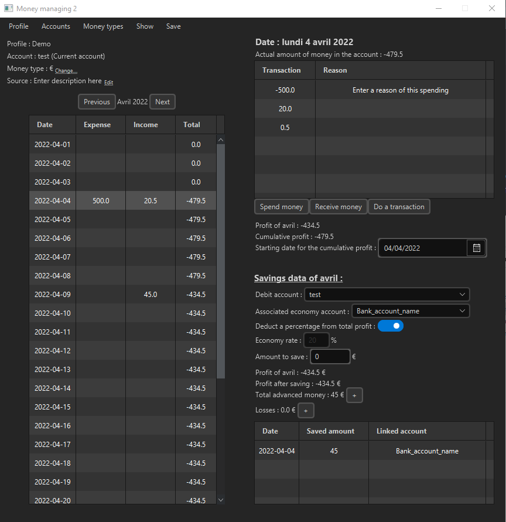

# financialDataManagement

My first Java project coded during the 2021 summer season. It aims at saving and vizualizing one's financial data.

I came up with this idea when I was getting tired to use Excel to save my financial data, which was becoming increasingly massive. It was also the opportunity for me  

# How to run it

As it was my first project in Java, I didn't have much knowledge about how to manage data files used in the code. Actually, all the informations are saved in .db files which have the following path: "C:\dev\moneyManager".

To make the code runnable, one thus needs to create this path or change the path name inside the code (https://github.com/tgoncalv/financialDataManagement/blob/main/FirstProject/src/main/java/fr/moneyManaging/Profile.java , line 32).

Once this has been done, the application can be executed by running the main code: https://github.com/tgoncalv/financialDataManagement/blob/main/FirstProject/src/main/java/gui/managing/Main.java 
